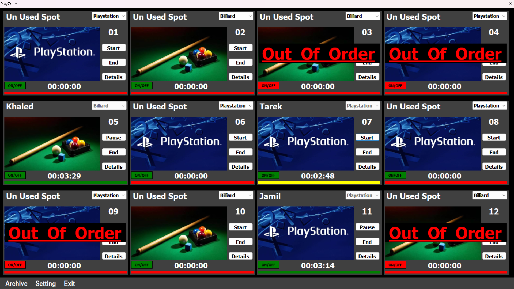
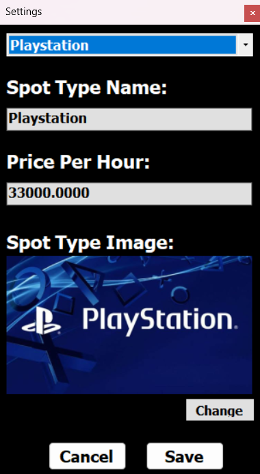
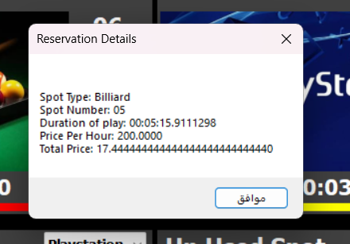
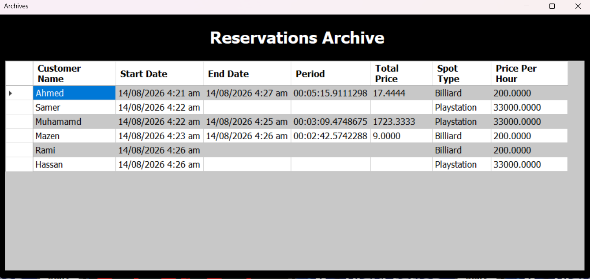

# 🎮 PlayZone - Gaming Lounge Management System

**PlayZone** is a desktop application designed to streamline operations for gaming lounges, PlayStation halls, and entertainment centers. Built with **C# (.NET)**, **Windows Forms**, and **SQL Server**, the system provides a real-time dashboard to monitor spots/devices, track rental durations with precision timers, calculate bills dynamically based on custom hourly rates, and maintain a complete historical archive of all reservations.

---

## 🖼️ Application Screenshots

  
  

 

  
  

---

## 🌟 Key Features

### ⏱️ Real-Time Spot & Session Control
* **Grid Dashboard:** Visual grid view supporting up to 12+ individual spots simultaneously.
* **Multi-Activity Support:** Configure and manage different entertainment spot types including **PlayStation**, **Billiard**, and **Soccer Table**.
* **Session Controls:** Real-time **Start**, **Pause**, and **End** triggers for active rental sessions with live duration timers.
* **Status Flags:** Easily toggle spots between active, available (Unused Spot), or disabled (**Out Of Order**) states for maintenance.

### 💰 Dynamic Billing & Checkout
* **Automated Fare Calculation:** Instant calculation of total price upon ending a session based on exact elapsed duration (`Duration * Hourly Rate`).
* **Detailed Receipts:** Displays full session breakdown including Customer Name, Spot Type, Spot Number, Play Duration, Hourly Rate, and Total Cost.

### ⚙️ Spot & Price Configuration
* **Custom Spot Types:** Add or modify spot names (e.g., Billiard, PlayStation).
* **Hourly Rate Management:** Set dynamic pricing per hour for each activity type.
* **Custom Visuals:** Assign dedicated thumbnail images for distinct spot types.

### 📜 Reservations Archive & Auditing
* **Centralized Logs:** Complete historical log storing `Customer Name`, `Start Date/Time`, `End Date/Time`, `Duration`, `Spot Type`, `Hourly Rate`, and `Total Price`.
* **Revenue Tracking:** Track past sessions for audit and business reporting purposes.

---

## 🛠️ Tech Stack & Architecture

* **Language:** C# (.NET)
* **User Interface:** Windows Forms (WinForms)
* **Database:** Microsoft SQL Server
* **Data Access:** ADO.NET
* **Architecture:** Layered Architecture (Presentation Layer, Business Logic Layer, Data Access Layer)

---

## 📁 Database Schema Overview

The database manages real-time spot states, pricing tables, and historical session logs:

1. **Spots / SpotTypes Table:** Stores activity categories, hourly rates, and visual assets.
2. **Reservations / Archive Table:**
   * `ReservationID` (PK)
   * `CustomerName` (NVARCHAR)
   * `SpotType` (NVARCHAR)
   * `SpotNumber` (INT)
   * `StartTime` / `EndTime` (DATETIME)
   * `Period` (TIME/VARCHAR)
   * `PricePerHour` / `TotalPrice` (DECIMAL/FLOAT)

---

## 🚀 How to Run the Project

### Prerequisites
* **Visual Studio** (2019 / 2022 / 2026) with .NET Desktop Development workload.
* **Microsoft SQL Server** & **SQL Server Management Studio (SSMS)**.

### Setup Steps
1. **Clone the repository:**
   git clone https://github.com/Muhammad-sadaka/PlayZone-Lounge-Management-System.git

2. **Database Setup:**
   * Open **SSMS** and create a new database named `PlayZoneDB`.
   * Run the SQL creation script (`PlayZone_DbScript.sql`) provided in the repository to generate tables and default spot configurations.

3. **Configure Connection String:**
   * Open the project in Visual Studio.
   * Update the SQL Server connection string in `App.config` or your Data Access settings file to target your local database.

4. **Build and Run:**
   * Press `F5` to build and launch the application.

---

## 👨‍💻 Author

**Muhammad Sadaka**  
* GitHub: [@Muhammad-sadaka](https://github.com/Muhammad-sadaka)
